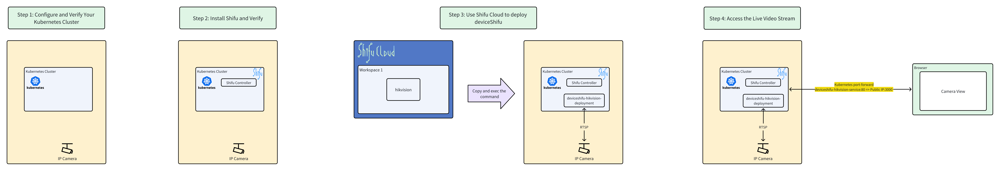

# Step 3: Use Shifu Cloud to Deploy deviceShifu


**Overview Architecture Diagram**


## Deploy your devices using [***Shifu Cloud***](https://shifucloud.testing.shifu.dev/).


### Login to Shifu Cloud

- Use the following Credentials to login to [***Shifu Cloud***](https://shifucloud.testing.shifu.dev/):
  - Username: `demo@edgenesis.com`
  - Password: `shifuclouddemo`

- Click to create a Kubernetes Secret for your device.
```bash
kubectl create secret -n deviceshifu generic hikvision-hikvision-secret  --from-literal=IP_CAMERA_PASSWORD=HelloShifu
```{{ exec }}

- Click the `hikvision` device in your workspace.


- **Deploy Your Device:** Click `Deploy` to receive a command. Similar to the previous step, copy and execute this command in your terminal to deploy the device into your cluster.


This command will download a YAML file from the specified URL, and based on the configurations within that file, it will deploy deviceShifu in your Kubernetes cluster.

👉Click to check the deployment status of deviceShifu.(The device will be deployed to this cluster in less than 1 minute).

```bash
kubectl get pods -n deviceshifu
```{{ exec }}

✔️When `READY` is `2/2` and `STATUS` is `Running`, the deployment is successfull.
```text
controlplane $ kubectl get pods -n deviceshifu
NAME                                               READY   STATUS    RESTARTS   AGE
deviceshifu-hikvision-deployment-d86c5bf46-m95p4   2/2     Running   0          24s
```

🔔 If you encounter any problems during the demo, please contact us at [info@edgenesis.com](mailto:info@edgenesis.com), we will assist you immediately.
