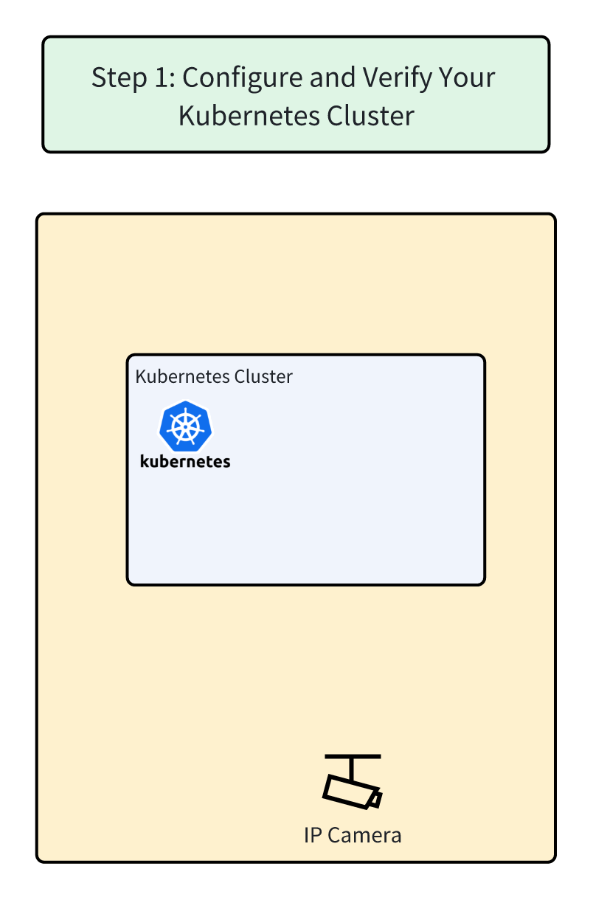

# Step 1: Configure and Verify Your Kubernetes Cluster



**Overview Architecture Diagram**


## Preparation

You'll need a running Kubernetes cluster to use Shifu. In this demo, we'll use the pre-configured Kubernetes cluster from KillerCoda.

👉Click to ensure your cluster is ready: `kubectl get nodes`{{execute}}

✔️The cluster should contain two nodes, `controlplane` and `node01`. Those nodes' `status` should be `Ready`.

```
controlplane $ kubectl get nodes
NAME           STATUS   ROLES           AGE   VERSION
controlplane   Ready    control-plane   41h   v1.29.0
node01         Ready    <none>          41h   v1.29.0
```

🔔Need help? Contact us at [info@edgenesis.com](mailto:info@edgenesis.com). We will help you out immediately.
