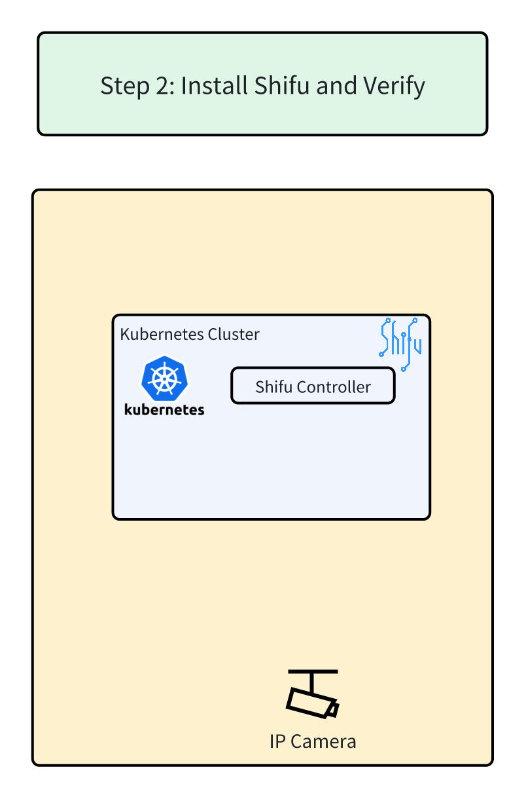

# Step 2: Install Shifu and Verify



**Overview Architecture Diagram**


👉Click to Install ***Shifu***.

```bash
kubectl apply -f https://raw.githubusercontent.com/Edgenesis/shifu/v0.39.0/pkg/k8s/crd/install/shifu_install.yml
```{{ exec }}

👉Click to Verify Installation Status. (It may take up to ⏰20 seconds⏰ to install.)

```bash
kubectl get pods -n shifu-crd-system 
```{{ exec }}


✔️When `READY` is `2/2` and `STATUS` is `Running`, Shifu is installed.

```text
controlplane $ kubectl get pods -n shifu-crd-system 
NAME                                           READY   STATUS    RESTARTS   AGE
shifu-crd-controller-manager-98bb47fc9-828dl   2/2     Running   0          22s
```

🔔Need help? Contact us at [info@edgenesis.com](mailto:info@edgenesis.com). We will help you out immediately.
