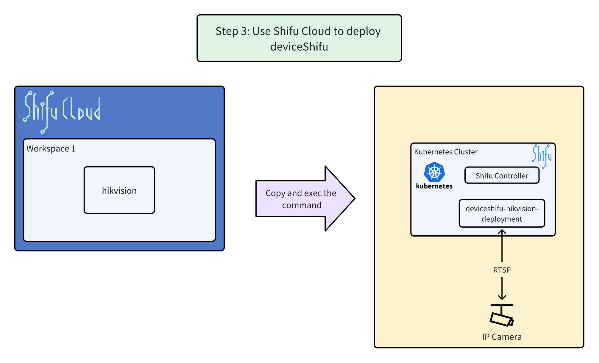

# Step 3: Use Shifu Cloud to Deploy deviceShifu



**Overview Architecture Diagram**


## Deploy your devices using [***Shifu Cloud***](https://cloud.shifu.dev/).

### (New User Only) Register with Shifu Cloud

- **Register Your Account:** Navigate to the Sign-up Page.


- Enter your email and password, then click "Sign up".


- **Email Verification:** Check your email inbox for the verification email and click the provided link to verify your account.


### Create Workspace and Device

- **Create Workspace:** Log into [***Shifu Cloud***](https://cloud.shifu.dev/) and click on "New Workspace".


- Specify a name for your workspace.


- **Create Device by Template:** Within your workspace, select "Template" to initiate device creation using templates.


- Choose the "hikvisioncamera" template.


- Name your device "hikvision". (⚠️**Please make sure you use the exact name for this demo**)

- Enter the following configuration details (💡Tips: Click the value to copy):
  - Device Address: `bj-hikcamera-01.saifai.cn`
  - RTSP Port: `40554`
  - HTTP Port: `40081`
  - Username: `guest`
  - Password: `HelloShifu`

  

- Before deploying your device, make sure you have created the Kubernetes Secret:
  - Scroll down and copy the command displayed at the bottom of the configuration form.
  - Paste this command into your terminal where Shifu is running.
  - Execute the command to create the secret.

  

- **Deploy Your Device:** Click "Deploy" to receive a command. Similar to the previous step, copy and execute this command in your terminal to deploy the device into your cluster.


This command will download a YAML file from the specified URL, and based on the configurations within that file, it will deploy deviceShifu in your Kubernetes cluster.

👉Click to check the deployment status of deviceShifu.(The device will be deployed to this cluster in less than 1 minute).

```bash
kubectl get pods -n deviceshifu
```{{ exec }}

✔️When `READY` is `2/2` and `STATUS` is `Running`, the deployment is successfull.
```text
controlplane $ kubectl get pods -n deviceshifu
NAME                                               READY   STATUS    RESTARTS   AGE
deviceshifu-hikvision-deployment-d86c5bf46-m95p4   2/2     Running   0          24s
```

🔔 If you encounter any problems during the demo, please contact us at [info@edgenesis.com](mailto:info@edgenesis.com), we will assist you immediately.
