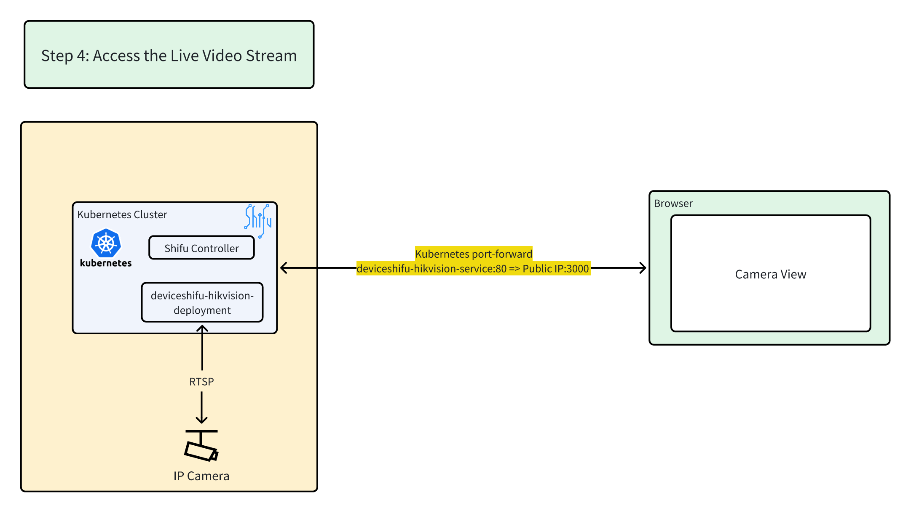

# Step 4: Access the Live Video Stream



**Overview Architecture Diagram**


👉Click to Expose the deviceShifu Service.

```bash
kubectl port-forward svc/deviceshifu-hikvision-service -n deviceshifu 3000:80 --address=0.0.0.0
```{{ exec }}

## To view a live capture

👉Click 📷[capture]({{TRAFFIC_HOST1_3000}}/capture)📷 to see a live photo from the Beijing camera

## To view a live video stream

👉Click 📹[stream]({{TRAFFIC_HOST1_3000}}/stream)📹 to see a real-time video stream from the Beijing camera

**🎉 You're now viewing a live feed from our office in Beijing, China! 🎉**

🔔Need help? Contact us at [info@edgenesis.com](mailto:info@edgenesis.com). We will help you out immediately.
