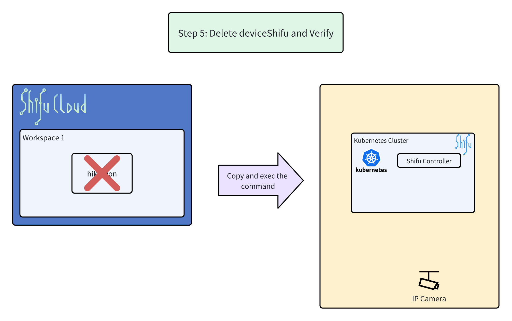
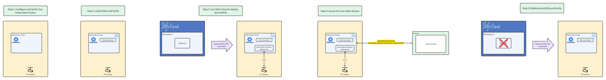
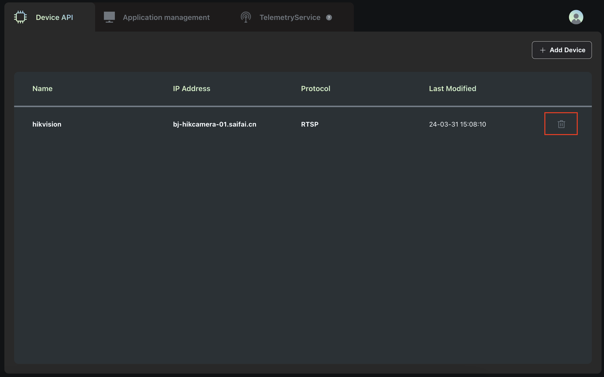
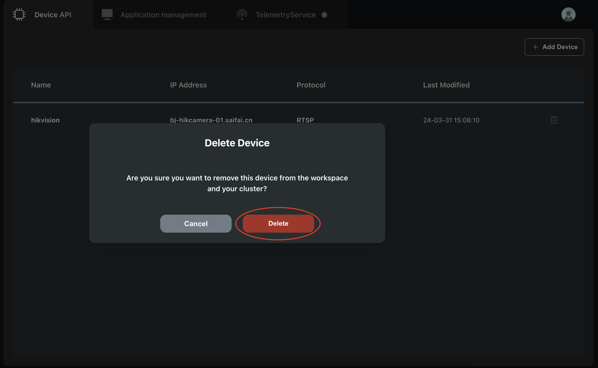
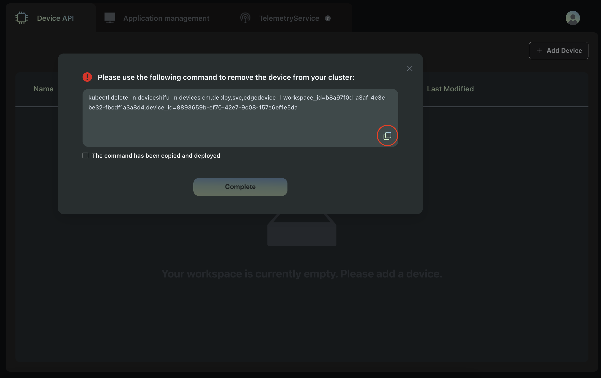
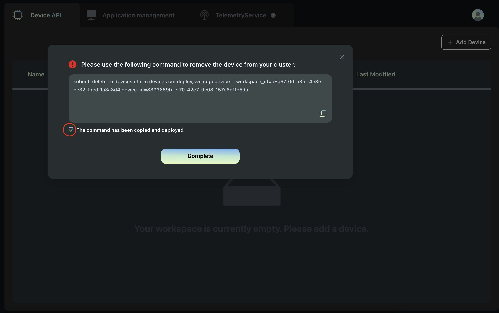

# Step 5: Delete deviceShifu and Verify

**Overview Architecture Diagram**

## Stop the Service
1. Stop the exposed deviceShifu Service using `Ctrl+C`.

## Delete the device from Shifu Cloud and your cluster
1. In Shifu Cloud, delete the device by clicking the delete icon next to the device name.

2. Confirm the deletion by clicking `Delete`.

3. Copy the displayed command using the copy button, return to KillerCoda, and execute the command to delete the device from the cluster.

4. In Shifu Cloud, toggle and confirm the deletion of the device.

🔔Need help? Contact us at [info@edgenesis.com](mailto:info@edgenesis.com). We will help you out immediately.
