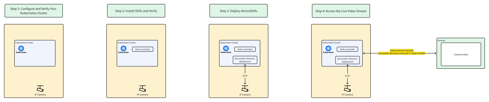

# Connect an IP camera to your Kubernetes cluster in under 3 minutes!

————————————————————————————————————————————————————————————————————————————————
 
In this demo, you'll connect a **live, office-facing camera** to your Kubernetes cluster.
 

**Overall Architecture Diagram**

 
Get hands-on experience with IoT in Kubernetes!

You can follow the steps to try and connect the camera by yourself very easily.
 

**Start NOW!!**
 
Don't refresh the website during the demo, or you'll lose all your progress and have to restart.
 

——————————————————————————————————————————————————————————————————————————————————
 

🔔Need help? Contact us at [info@edgenesis.com](mailto:info@edgenesis.com). We will help you out immediately.
