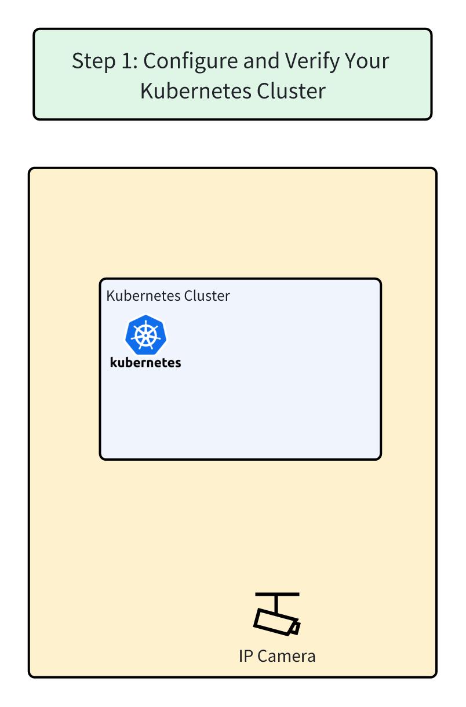

## Step 1: Configure and Verify Your Kubernetes Cluster
You'll need a Kubernetes cluster running to use Shifu. For your convenience, we've already configured a cluster for you to try.



**Overall Architecture Diagram**


————————————————————————————————————————————————————————————————————————————————
<br/>
👉Click to ensure your cluster is ready: `kubectl get nodes`{{execute}}
<br/>

✔️The cluster should contain two nodes, `controlplane` and `node01`. Those nodes' `status` should be `Ready`.
```
controlplane $ kubectl get nodes
NAME           STATUS   ROLES           AGE   VERSION
controlplane   Ready    control-plane   41h   v1.29.0
node01         Ready    <none>          41h   v1.29.0
```
<br/>
————————————————————————————————————————————————————————————————————————————————
<br/>

🔔Need help? Contact us at [info@edgenesis.com](mailto:info@edgenesis.com). We will help you out immediately.
