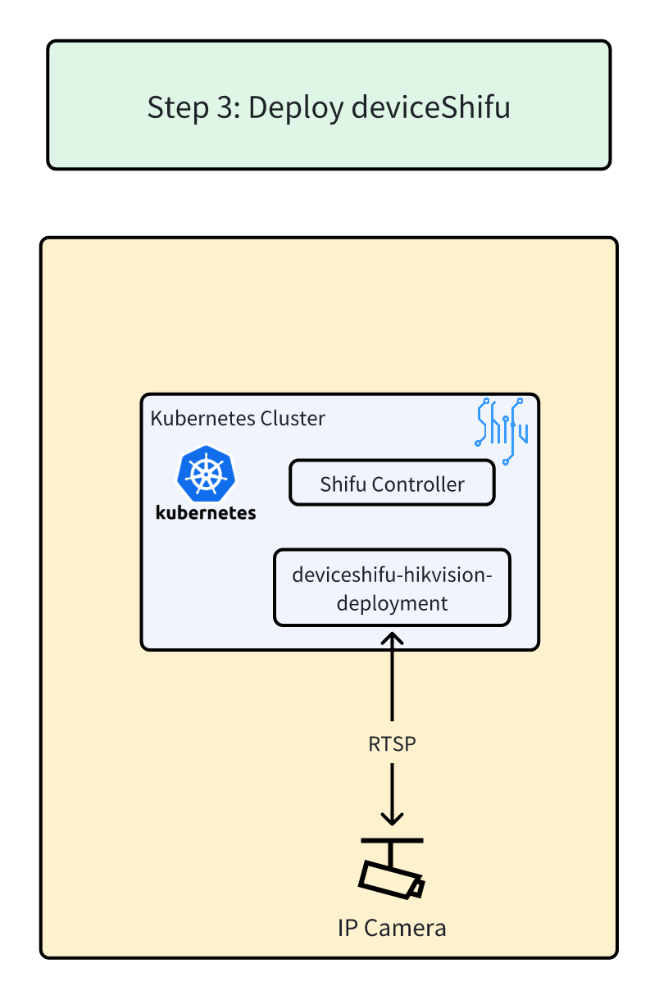

## Step 3: Deploy deviceShifu



[Overall Architecture](../../images/shifu/overall_architecture.png)

👉Click to Deploy ***deviceShifu***.
```bash
kubectl apply -f https://storage.googleapis.com/shifu-demo-bucket/shifu-hikvision-deploy.yaml
```{{ exec }}


* **Explanation:** This command deploys deviceShifu to your Kubernetes cluster using the configuration defined in the provided YAML file.

👉Click to Check Deployment Status.(Allow approximately 1 minute for deployment to complete)

```bash
kubectl get pods -n deviceshifu
```{{ exec }}

<br/>

✔️When `READY` is `2/2` and `STATUS` is `Running`, deployment is done.
```text
controlplane $ kubectl get pods -n deviceshifu
NAME                                               READY   STATUS    RESTARTS   AGE
deviceshifu-hikvision-deployment-d86c5bf46-m95p4   2/2     Running   0          24s
```

🔔Need help? Contact us at [info@edgenesis.com](mailto:info@edgenesis.com). We will help you out immediately.
