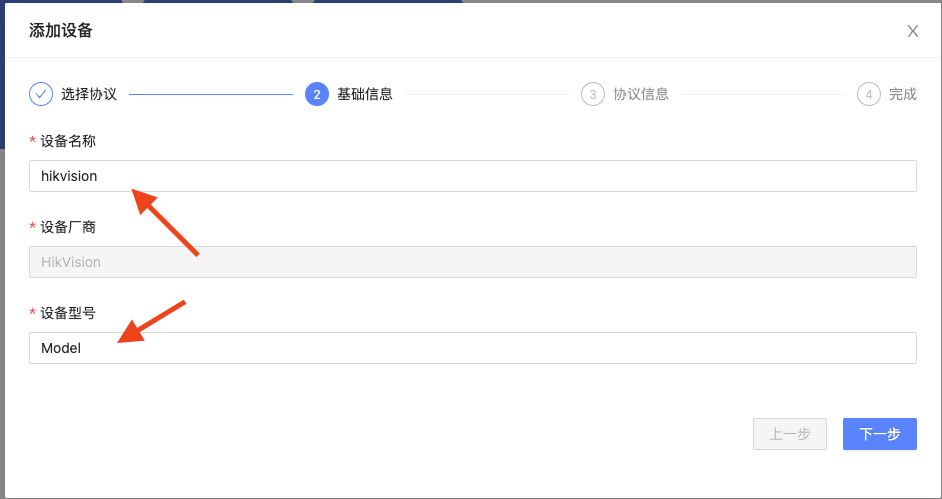
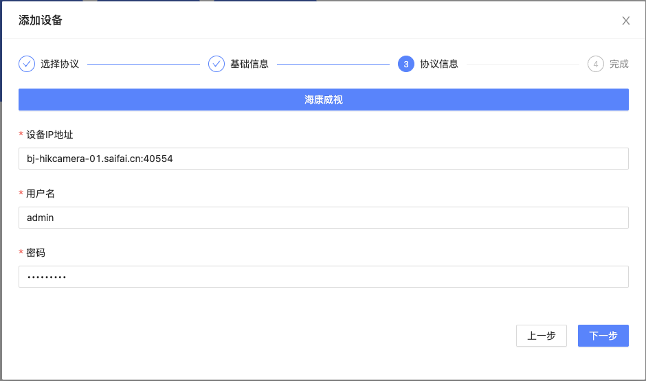
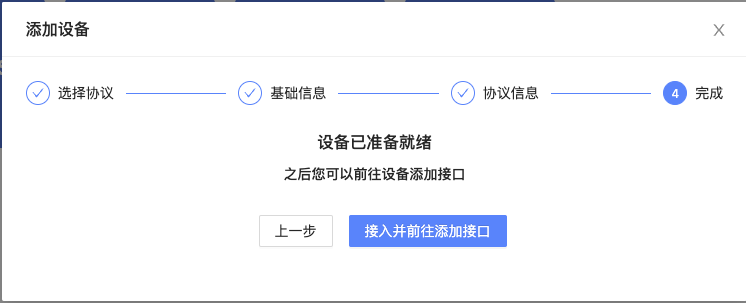
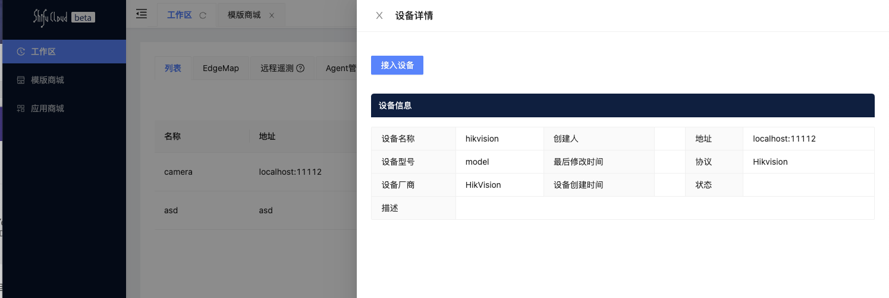

回到 Shifu Cloud 中，在模版商城中选择 Hikvision


填写`设备名称`和`设备型号`



填写设备IP地址，用户名和密码,如果您没有设备可以使用我们的测试账号

设备IP地址: `bj-hikcamera-01.saifai.cn:40554`{{ copy }}

用户名: `admin` {{ copy }}

密码: `HikVQDRQL` {{ copy }}



点击`接入并前往添加接口`



点击`接入设备` 即可将摄像头接入



我们可以使用该命令查看该摄像头的部署情况

```
kubectl get pods -n deviceshifu
```

当该 pod 的 Ready 为`2/2` Status 为`Running`时则表示部署成功
